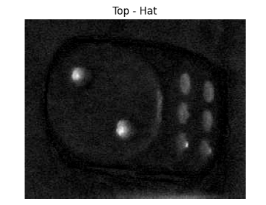
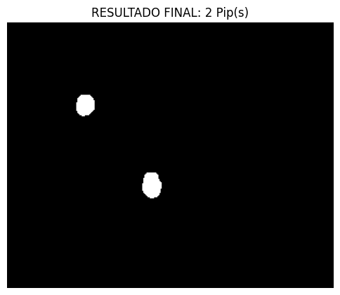

# 🎲 Contador de Pips em Dados (Dice Pip Counter)


> Um algoritmo de Visão Computacional capaz de identificar, segmentar e contar automaticamente os pontos (pips) em faces de dados, ignorando reflexos e variações de iluminação.

## 📄 Sobre o Projeto

Este projeto foi desenvolvido como parte da disciplina de **Processamento de Imagens** na Universidade Federal de Sergipe (UFS). 

O objetivo principal é resolver o problema da contagem de pontos em dados de 6 faces sob diferentes condições de luz. Diferente de abordagens baseadas em Inteligência Artificial (Deep Learning), este projeto utiliza puramente **Morfologia Matemática** e **Processamento de Imagens Clássico**, o que torna o algoritmo extremamente leve e rápido.

### Principais Desafios Resolvidos:
* Remoção de sombras graduais na superfície do dado.
* Distinção entre "pips" (pontos reais) e reflexos especulares (brilhos falsos).
* Contagem robusta independente da rotação do dado.

## 🖼️ Demonstração

| Imagem Original | Processamento (Top-Hat) | Resultado Final |
|:---:|:---:|:---:|
|  |  |  |

## 📂 Banco de Dados Utilizado

As imagens utilizadas para o desenvolvimento e teste deste algoritmo foram obtidas através da plataforma **Roboflow**.

* **Projeto Original:** [Pips Computer Vision Model]
* **Link do Dataset:** [https://universe.roboflow.com/redesai/pips-rwnyg](https://universe.roboflow.com/redesai/pips-rwnyg)
* **Créditos:** Agradecimentos aos criadores do dataset pela disponibilização das imagens.

## 🛠️ Tecnologias Utilizadas

O projeto foi desenvolvido em Python utilizando as seguintes bibliotecas:

* **[OpenCV](https://opencv.org/) / [Scikit-Image](https://scikit-image.org/):** Para manipulação de imagens, filtros e morfologia.
* **[NumPy](https://numpy.org/):** Para operações matriciais de alta performance.
* **[Matplotlib](https://matplotlib.org/):** Para visualização dos resultados e plotagem de gráficos.
* **[Jupyter Notebook](https://jupyter.org/):** Para desenvolvimento interativo e documentação dos testes.

## ⚙️ Como Funciona (Pipeline)

O pipeline de processamento foi projetado para ser robusto contra variações de iluminação e sombras, utilizando transformações morfológicas e filtros espaciais do ecossistema Scikit-Image.

1. **Conversão para Escala de Cinza (Scikit-Image)**
Em vez de uma média simples, utilizamos a função profissional color.rgb2gray da biblioteca scikit-image.

* **Conversão Inteligente:** O algoritmo detecta se a imagem é JPG ou PNG (RGBA) e realiza a conversão para tons de cinza baseada na percepção humana.

* **Normalização:** Como a função devolve valores entre 0.0 e 1.0, o código converte automaticamente para a escala uint8 (0-255), garantindo compatibilidade com os filtros de brilho posteriores.

2. **Realce de Contraste (Top-Hat)**
Aplicação da transformação White Top-Hat. Esta operação morfológica destaca elementos claros (os pips) e remove o fundo (face do dado), compensando variações de iluminação e sombras na superfície do objeto.

3. **Segmentação e Limpeza**
* **Filtro de Mediana:** Suavização para remoção de ruídos sem destruir as bordas dos pontos.

* **Binarização:** Separação definitiva dos pontos do fundo através de um limiar (Threshold) ajustável.

* **Abertura Morfológica:** Limpeza de ruídos residuais para isolar perfeitamente cada ponto do dado.

4. **Contagem e Validação Geométrica (RegionProps)**
A contagem final é realizada pela função regionprops, que analisa cada objeto encontrado e aplica filtros de qualidade:

* **Área:** Elimina reflexos pequenos ou clarões grandes demais.

* **Excentricidade:** Filtra apenas objetos com formato circular, ignorando riscos, sombras alongadas ou imperfeições na face do dado.

## 🚀 Como Executar

### Pré-requisitos
Certifique-se de ter o [Python 3.14.3](https://www.python.org/) instalado.

### Passo 1: Instalação

1. Clone o repositório:
   ```bash
   git clone https://github.com/MatheusNascimento30/contador-de-pips-da-face-de-cubos.git
   ```
2. No terminal, instale as dependências necessárias:
  ```bash
  pip install -r requirements.txt
  ```
### Passo 2: Configurar as Imagens

1. copie o caminho das imamagens,
2. Na pasta imagngens,
3. atualize o caminho na Célula 3:
  ```python
  arquivo = r'Coloque aqui o caminho da imagem'
  ```
4. Se der erro nessa parte retire o r do início

### Passo 3: Executar

Abra o arquivo `solucao.ipynb` no VS Code.
1. Selecione o Kernel do Python no canto superior direito.
2. Clique em **Run All** (Executar Tudo).

## 🎥 Vídeo Demonstrativo

Confira a explicação detalhada e o código em execução:

▶️ **[CLIQUE AQUI PARA ASSISTIR AO VÍDEO](https://youtu.be/FR2u25xdoy4)**

## 👥 Autor

**Matheus Nascimento dos Santos**

- Curso: Ciência da Computação - UFS
- Matrícula: [202300083810]

*Projeto desenvolvido para a disciplina de Processamento de Imagens.*
